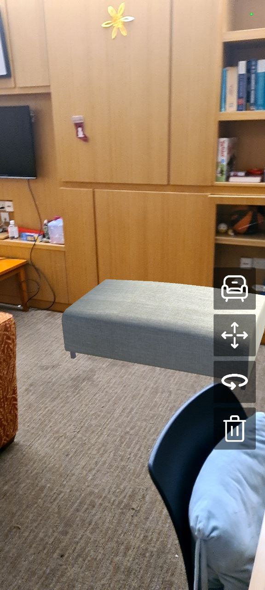
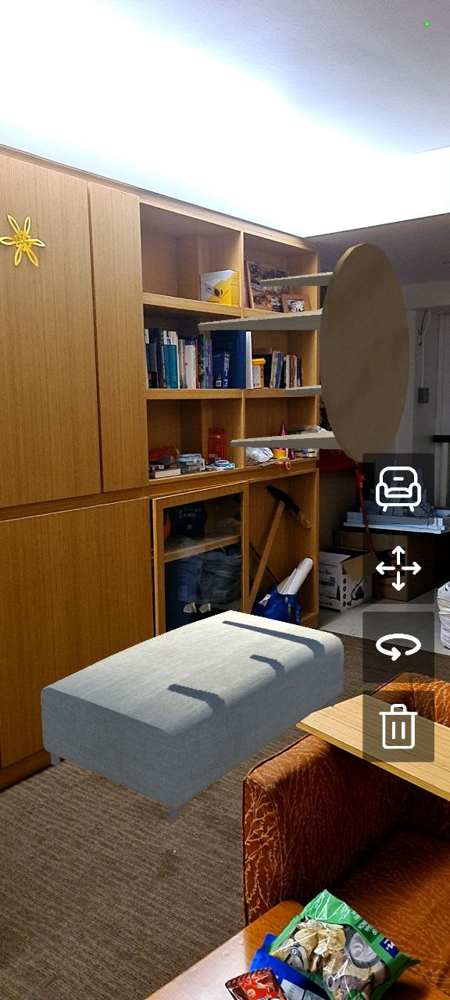

# Interaction Design for AR
Furniture Placement App for Android, completed as part of coursework in school  
Referenced from https://varlabs.comp.nus.edu.sg/unitylab/learn/core_3_new.html/

## Unity Version
Unity 2020.2.1f1

## Packages Used
- 2D Sprite 1.0.0
- AR Foundation 4.0.10
- ARCore XR Plugin 4.0.10
- ARKit XR Plugin 4.0.10
- Device Simulator 3.0.3-preview
- JetBrains Rider Editor 2.0.7
- Test Framework 1.1.19
- TextMeshPro 3.0.1
- Timeline 1.4.4
- Unity Collaborate 1.3.9
- Unity UI 1.0.0
- Visual Studio Code Editor 1.2.3
- Visual Studio Editor 2.0.5
- XR Plugin Management 3.2.17

